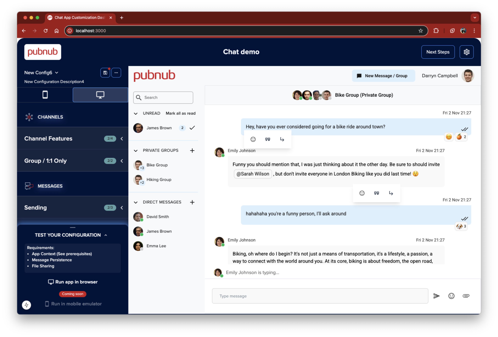

# Customized Chat Application

Customized chat applications powered by the PubNub Chat SDK

This application is designed to be used in conjunction with the [Chat Builder Dashboard](https://customized-chat-app-dashboard.netlify.app/)

## Implementation Status

### Platforms

| | Web (TypeScript) | Android | iOS |
| ---- | ---- | ---- | ---- |
| Description | Web app written in React (Next.js) | Native Android application written in Kotlin | Native iOS application written in Swift |
| SDK | [PubNub JavaScript Chat SDK](https://www.pubnub.com/docs/chat/chat-sdk) | [PubNub Kotlin Chat SDK](https://www.pubnub.com/docs/chat/kotlin-chat-sdk) | [PubNub Swift Chat SDK](https://www.pubnub.com/docs/chat/swift-chat-sdk) |
| Status | **Mostly Complete** | *In Progress* | *In Progress* |
| Platform ReadMe  | | [Android ReadMe](./android/README.md) | [iOS ReadMe](./ios/README.md) |

### Features

| Feature | Description | Docs |
| --- | --- | --- |
| Logging In | The demo allows you to choose from one of a list of pre-existing users | |
| Public Channels | Channels anybody can join and send / receive messages | [Docs](https://www.pubnub.com/docs/chat/chat-sdk/build/features/channels/create#create-public-channel) |
| Sending & Receiving messages | Send a receive messages reliably and at scale using PubNub's infrastructure  | [Docs](https://www.pubnub.com/docs/chat/chat-sdk/build/features/messages/send-receive) |
| Message History | Store and retrieve any number of historic messages, per channel. | [Docs](https://www.pubnub.com/docs/chat/chat-sdk/build/features/messages/history)  |
| Message Reactions (emoji) | Add emoji reactions and updates others in real-time that a message's reactions have changed. | [Docs](https://www.pubnub.com/docs/chat/chat-sdk/build/features/messages/reactions)  |
| Quoting a Message | Add  context to your message by quoting a previous messages | [Docs](https://www.pubnub.com/docs/chat/chat-sdk/build/features/messages/quotes#quote-message)  |
| Pinning a Message | Pin a message on a per-channel basis | [Docs](https://www.pubnub.com/docs/chat/chat-sdk/build/features/messages/pinned)  |
| Replying in a Thread | Message threads are first class citizens to keep conversations organized. | [Docs](https://www.pubnub.com/docs/chat/chat-sdk/learn/chat-entities/thread-channel)  |
| Forward a Message | Forward a message from one channel to another | [Docs](https://www.pubnub.com/docs/chat/chat-sdk/build/features/messages/forward)  |
| Edit Messages | Change a message's contents whilst keeping a record of all changes made. | [Docs](https://www.pubnub.com/docs/chat/chat-sdk/build/features/messages/updates)  |
| Delete Messages | Delete a message which can be (optionally) later recovered. | [Docs](https://www.pubnub.com/docs/chat/chat-sdk/build/features/messages/delete)  |
| Restore a deleted Message | Restore a previously deleted message | [Docs](https://www.pubnub.com/docs/chat/chat-sdk/build/features/messages/restore)  |
| Report a Message for moderation | Notify an administrator that a message needs attention (uses BizOps Workspace) | [Docs](https://www.pubnub.com/docs/chat/chat-sdk/build/features/messages/moderation)  |
| Private Groups | A group (channel) intended for a predefined selection of users.   | [Docs](https://www.pubnub.com/docs/chat/chat-sdk/build/features/channels/create#create-group-channel)  |
| Direct (1:1) Conversations | A channel designed for 2 participants only | [Docs](https://www.pubnub.com/docs/chat/chat-sdk/build/features/channels/create#create-direct-channel)  |
| Group (Channel) Settings | Change the metadata associated with a channel such as name or display background | [Docs](https://www.pubnub.com/docs/chat/chat-sdk/learn/chat-entities/channel#properties)  |
| Read Receipts | Keep track of which messages have been sent and read | [Docs](https://www.pubnub.com/docs/chat/chat-sdk/build/features/messages/read-receipts)  |
| Typing Indicator | Be notified when a user or users are typing on a per-channel basis. | [Docs](https://www.pubnub.com/docs/chat/chat-sdk/build/features/channels/typing-indicator)  |
| Unread Messages | Keep track of unread messages per-channel and catch-up on missed activity when reloading the application | [Docs](https://www.pubnub.com/docs/chat/chat-sdk/build/features/messages/unread)  |
| Marking Messages as Read | Mark messages as read on a per-message, per-channel or global basis | [Docs](https://www.pubnub.com/docs/chat/chat-sdk/build/features/messages/unread#mark-messages-as-read-all-channels)  |
| User Presence | This application shows global user presence.  The Chat SDK also supports per-channel User presence. | [Docs](https://www.pubnub.com/docs/chat/chat-sdk/build/features/users/presence)  |
| Adding File Attachments | Exchange file attachments such as images, video and documents.  Uses PubNub's serverless storage. | [Docs](https://www.pubnub.com/docs/chat/chat-sdk/build/features/messages/files)  |
| Mentioning Users | @Mention a user by name and they will be notified. | [Docs](https://www.pubnub.com/docs/chat/chat-sdk/build/features/users/mentions)  |
| Referencing Channels | #Reference a channel by name to add context to a message | [Docs](https://www.pubnub.com/docs/chat/chat-sdk/build/features/channels/references)  |
| Your Profile | User information is stored in PubNub and edits are shared in real-time with other users | [Docs](https://www.pubnub.com/docs/chat/chat-sdk/build/features/users/details#get-current-user)  |
| View others' profiles | Keep track of all your app's users' public information |  |
| Synchronizing Updates | Updates to User or Channel metadata are shared in real-time with all app users regardless of scale. |  |
| Integration with BizOps Workspace User & Channel Management | Manage users and channels, i.e. see and modify their metadata, using PubNub BizOps Workspace | [Docs](https://www.pubnub.com/docs/bizops-workspace/user-management)  |
| Integration with BizOps Workspace Channel Monitor | Monitor and moderate individual channels | [Docs](https://www.pubnub.com/docs/bizops-workspace/channel-monitor)  |
| Integration with BizOps Workspace User Moderation | Mute or Ban users so they are unable to participate in conversations | [Docs](https://www.pubnub.com/docs/chat/chat-sdk/build/features/users/moderation)  |
| Mobile Push Messages | Automatically send PubNub messages as FCM or APNS messages so your users can continue using your app when it is in the background on mobile. | [Docs](https://www.pubnub.com/docs/general/push/send)  |

## Demo

1. Load the dashboard (https://customized-chat-app-dashboard.netlify.app/)
1. Configure your application as needed, or use one of the predefined templates
1. Create and configure a PubNub Keyset from the [PubNub Admin Portal](https://admin.pubnub.com/)
1. Provide the keyset to the dashboard and follow the instructions to run or build your application.

### Get Your PubNub Keys

1. You’ll first need to sign up for a [PubNub account](https://admin.pubnub.com/signup/). Once you sign up, you can get your unique PubNub keys from the [PubNub Developer Portal](https://admin.pubnub.com/).

1. Sign in to your [PubNub Dashboard](https://admin.pubnub.com/).

1. Click Apps, then **Create New App**.

1. Give your app a name, and click **Create**.

1. Click your new app to open its settings, then click its keyset.

1. The dashboard will list your keyset requirements.  It is important to note the App Context settings:  **Check** the following boxes: `User Metadata Events`, `Channel Metadata Events`, `Membership Events`.  **Uncheck** the following boxes: `Disallow Get All Channel Metadata`, `Disallow Get All User Metadata`

1. Copy the Publish and Subscribe keys and provide them to the [dashboard](https://customized-chat-app-dashboard.netlify.app/) .

## Building and Running

Follow the instructions on the [dashboard](https://customized-chat-app-dashboard.netlify.app/) to build or run the customized application for your platform(s) of choice.

## Contributing

Please fork the repository if you'd like to contribute. Pull requests are always welcome.